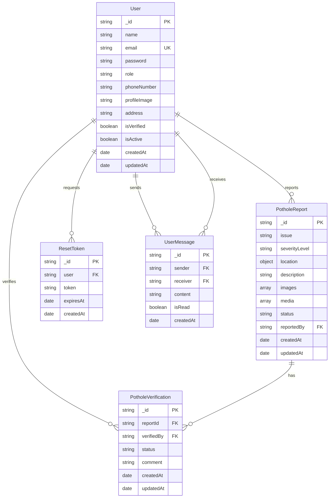

# Joura_Pothole Database Schema Diagram

This document visualizes the database schema and relationships for the Joura_Pothole application.

## Entity Relationship Diagram

## Schema Details

### User Schema
- **_id**: Unique identifier (ObjectId)
- **name**: Full name of the user
- **email**: Email address (unique)
- **password**: Hashed password
- **role**: User role (Citizen, Municipal, Admin)
- **phoneNumber**: Contact number
- **profileImage**: URL to profile image
- **address**: Physical address
- **isVerified**: Email verification status
- **isActive**: Account activation status
- **createdAt**: Timestamp of account creation
- **updatedAt**: Timestamp of last update

### PotholeReport Schema
- **_id**: Unique identifier (ObjectId)
- **issue**: Type of infrastructure issue (Pothole, Manhole, Road Crack, Water Leakage)
- **severityLevel**: Level of severity (Mild, Moderate, Severe)
- **location**: Object containing:
  - **coordinates**: [longitude, latitude]
  - **address**: Text address
- **description**: Detailed description of the issue
- **images**: Array of image URLs
- **media**: Array of video URLs
- **status**: Current status (Pending, In-Progress, Completed, Rejected)
- **reportedBy**: Reference to User who created the report
- **createdAt**: Timestamp of report creation
- **updatedAt**: Timestamp of last update

### PotholeVerification Schema
- **_id**: Unique identifier (ObjectId)
- **reportId**: Reference to PotholeReport
- **verifiedBy**: Reference to User (Municipal authority)
- **status**: Verification status (Verified, Rejected)
- **comment**: Feedback or comments from verifier
- **createdAt**: Timestamp of verification
- **updatedAt**: Timestamp of last update

### ResetToken Schema
- **_id**: Unique identifier (ObjectId)
- **user**: Reference to User
- **token**: Password reset token (hashed)
- **expiresAt**: Expiration timestamp
- **createdAt**: Timestamp of token creation

### UserMessage Schema
- **_id**: Unique identifier (ObjectId)
- **sender**: Reference to User who sent the message
- **receiver**: Reference to User who receives the message
- **content**: Message content
- **isRead**: Read status
- **createdAt**: Timestamp of message creation