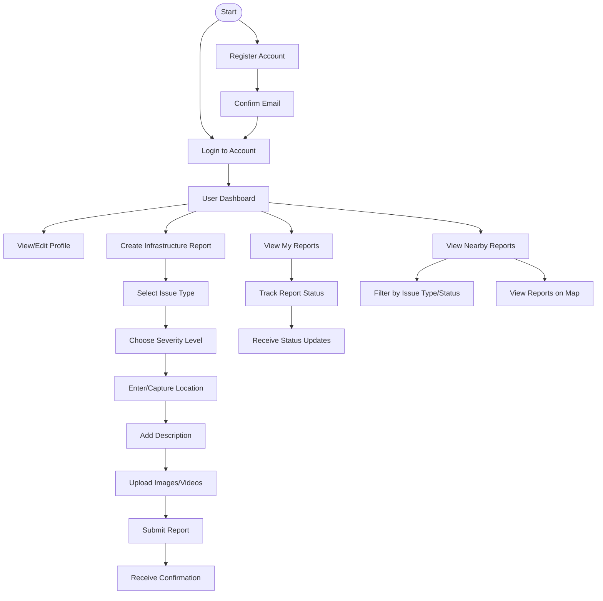
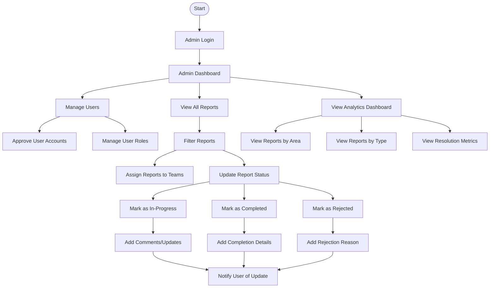
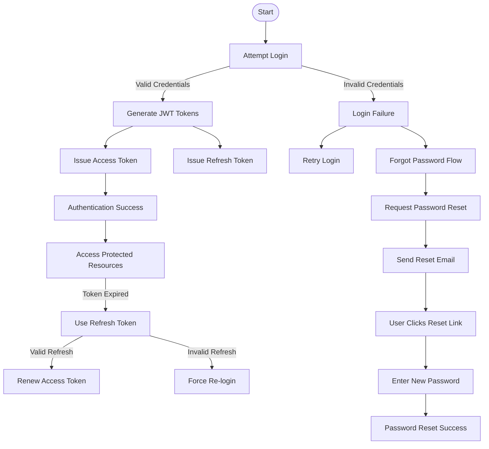

# Joura_Pothole User Flow Diagram

This document visualizes the primary user flows in the Joura_Pothole application.

## Citizen User Flow

## Admin/Municipal Authority Flow

## Authentication Flow

